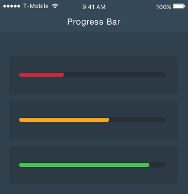

# react-native-gifted-progress

> Simple Progress Bar for React Native.



## Install

```
$ npm install --save react-native-gifted-progress
```


## Usage

```js
import React, { Component } from 'react';
import ProgressBar from 'react-native-gifted-progress';


export default class MyComponent extends Component {
  
  ...

  render() {
    return (
      <ProgressBar
        barColor={'#40C74B'}
        progress={20}
        barBackgroundColor={'#242F37'}
      />
    );
  }

  ...

}
```


## License

MIT © [Ismail Pelaseyed](http://github.com/homanp)
